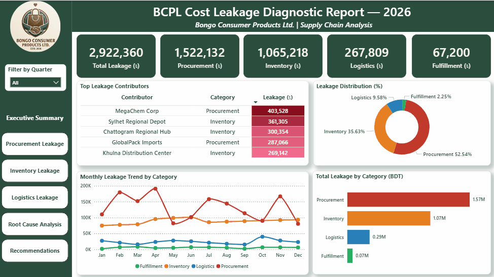
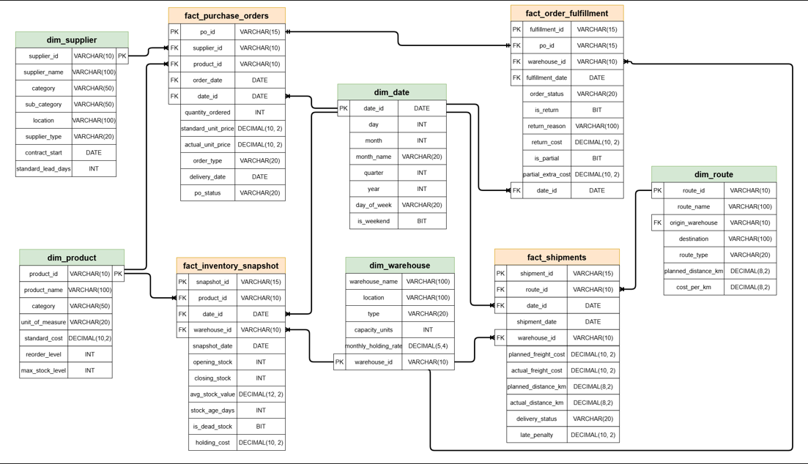

# 🔍 BCPL Supply Chain Cost Leakage Diagnostic & Recovery Plan

> End-to-end supply chain cost leakage analysis for a fictional Bangladeshi FMCG company — identifying ৳29.22 lakh in hidden costs across Procurement, Inventory, Logistics, and Fulfillment, with a prioritized recovery action plan projecting ৳15.93 lakh in potential annual savings.

---

## 📋 Executive Summary

Bongo Consumer Products Ltd. (BCPL) is a fictional Bangladeshi FMCG company whose supply chain costs grew 18% over 2025 while revenue grew only 7%. Management had no visibility into where the money was going — or how to stop it.

This project builds a complete cost leakage diagnostic and recovery framework from the ground up: a Python data pipeline generating and cleaning synthetic supply chain data, a SQL Server star schema with 7 analytical views calculating leakage by supplier, route, and warehouse, and a 6-page Power BI dashboard delivering executive-ready insights with a prioritized 7-point recovery action plan.

**Total leakage identified: ৳29.22 lakh.**

**Estimated recoverable savings: ৳15.93 lakh (54.52%).**

---

## ❓ Business Problem

> *"BCPL's supply chain cost has grown 18% over the past year, while revenue grew only 7%. Management suspects leakage across multiple functions — but cannot pinpoint where, or what to do about it."*

Most analytics projects stop at "here's the problem." This project goes further — identifying exactly where leakage is happening, quantifying the ৳ impact by category and contributor, and delivering a prioritized action plan with estimated savings per recommendation.

---

## 🔧 Methodology

This project followed a 5-phase end-to-end analytics pipeline:

**Phase 1 — Framework Design**
Defined cost leakage across 4 categories (Procurement, Inventory, Logistics, Fulfillment) with explicit formulas, flag thresholds, and leakage injection patterns before touching any data.

**Phase 2 — Data Pipeline (Python)**
Generated synthetic FMCG data across 9 tables (4,502 records), intentionally injected 8 types of data quality issues (nulls, duplicates, ID inconsistencies, outliers, mixed date formats), then built automated cleaning and validation scripts — achieving 100% validation pass rate. Full pipeline reproducible via single `main.py` command.

**Phase 3 — Data Modeling (SQL Server)**
Designed a star schema (5 dimension + 4 fact tables), loaded cleaned data via Python-SQL connection, and built 7 analytical views calculating leakage amounts, variance percentages, and Pareto rankings by supplier, route, and warehouse.

**Phase 4 — Dashboard (Power BI)**
Built a 6-page interactive dashboard with 15+ DAX measures, Pareto charts, scatter plot route risk matrix, and cross-page navigation — enabling drill-down from executive summary to root cause level.

**Phase 5 — Recommendations**
Delivered a prioritized 7-point recovery action plan with quantified ৳ savings estimates and implementation difficulty ratings, presented in both dashboard and standalone report formats.

**Savings Estimation Methodology**

Recovery rates were estimated based on leakage type:
- Procurement (60%) — assumes partial contract renegotiation; full recovery unlikely due to market pricing constraints
- Inventory (50%) — assumes dead stock liquidation at discount; some stock may be unrecoverable
- Logistics (55%) — assumes route optimization and carrier SLA enforcement; some overrun is structural (distance-based)

These are conservative illustrative estimates. Actual recovery depends on negotiation outcomes and operational changes.

---

## 🛠️ Skills & Tools

| Tool | Purpose |
|---|---|
| **Python** (pandas, numpy, faker) | Data generation, messiness injection, cleaning pipeline, validation |
| **SQL Server + T-SQL** | Star schema design, data load, 7 analytical views |
| **Power BI + DAX** | 6-page interactive dashboard, 15+ DAX measures |
| **Excel** | QA spot-check |

**Key Skills Demonstrated:**
- End-to-end data pipeline development (ETL)
- Synthetic data generation with realistic quality issues
- Star schema database design
- Cost leakage framework design
- Pareto analysis (80/20 rule)
- DAX measure development
- Executive-level reporting and recommendation framing

---

## 🔍 Results & Business Recommendations

### Key Findings

- 💰 **Total leakage identified: ৳29.22 lakh** across 4 supply chain categories
- 📦 **Procurement (52.54%)** — 3 import suppliers (MegaChem Corp, GlobalPack Imports, AsiaFood Commodities) responsible for 59% of procurement leakage via consistent price overcharging; emergency orders carry 20.8% avg variance vs 3.3% for regular orders
- 🏭 **Inventory (35.63%)** — 23.3% of stock flagged as dead stock (avg age 126 days); Packaged Food drives 49.88% of dead stock leakage; Sylhet depot worst offender (৳3.61 lakh)
- 🚚 **Logistics (9.58%)** — Sylhet Tea Belt: 40% late delivery rate, 32.83% avg freight overrun; Khulna–Jessore Belt: highest penalty cost (৳28,500)
- 📋 **Fulfillment (2.25%)** — 10.7% order error rate; partial shipments (৳52,800) larger than returns (৳14,400)
- 🎯 **80/20 confirmed** — Top 3 suppliers = 59% of procurement leakage; Top 3 routes = 76% of logistics leakage; Sylhet region appears as high-risk across Inventory, Logistics, and Root Cause dashboards

### Prioritized Recovery Action Plan

| Priority | Action | Category | Est. Saving (৳) | Difficulty |
|---|---|---|---|---|
| 1 | Re-negotiate MegaChem Corp contract | Procurement | 2,41,000 | Medium |
| 2 | Dual-source GlobalPack Imports | Procurement | 1,72,000 | Medium |
| 3 | Demand forecasting — Sylhet depot | Inventory | 1,80,000 | High |
| 4 | Route optimization — Sylhet Tea Belt | Logistics | 34,000 | Medium |
| 5 | Renegotiate AsiaFood Commodities | Procurement | 1,44,000 | Low |
| 6 | SKU rationalization — Packaged Food | Inventory | 1,50,000 | High |
| 7 | Carrier review — Khulna–Jessore Belt | Logistics | 32,000 | Low |
| | **Total Estimated Recovery** | | **9,53,000** | |

**Quick wins (Low difficulty, start immediately):**
- AsiaFood Commodities renegotiation → ৳1.44 lakh
- Khulna–Jessore carrier review → ৳32,000

📄 **[Read the full Insight Report →](05_docs/05_insight_report.md)**

📊 **[Read detailed Dashboard Insights →](05_docs/04_dashboard_insights.md)**

---

## 📊 Dashboard Preview

<p align="center">
  
</p>

📸 **See [`dashboard_image`](06_powerbi/dashboard_image) for full-page captures of all 6 dashboard pages.**

📊 **[Read detailed Dashboard Insights →](05_docs/04_dashboard_insights.md)**

---

## 🗄️ Database Design

<p align="center">
  
</p>

---

## 🚀 How to Reproduce

```bash
# 1. Clone the repo
git clone https://github.com/quietwithsuborno/supply-chain-cost-leakage-and-recovery

# 2. Install dependencies
pip install -r 03_python/requirements.txt

# 3. Run full data pipeline
python 03_python/main.py

# 4. Load to SQL Server
python 03_python/02_bulk_insert.py

# 5. Open Power BI dashboard
# Open 06_powerbi/bcpl_cost_leakage_dashboard.pbix
```

---

## 🔮 Next Steps & Future Improvements

- **Savings calculation transparency** — Recovery rate assumptions (60% Procurement, 50% Inventory, 55% Logistics) should be validated with sensitivity analysis showing best/worst case scenarios; currently these are illustrative estimates only
- **Fulfillment deep-dive** — A dedicated Fulfillment dashboard page would strengthen the analysis; currently Fulfillment is represented as a KPI only, without root cause breakdown by warehouse or product category
- **Inventory chart clarification** — The 31–60 day holding cost bucket appears highest because it reflects total stock volume, not dead stock only; a clearer annotation or separate dead-stock-only view would reduce potential misinterpretation
- **Logistics recommendations specificity** — Route optimization and carrier review recommendations could be strengthened with operational detail (e.g. shipment consolidation frequency, specific penalty enforcement mechanisms)
- **Real data validation** — All cost assumptions are illustrative; in a real engagement, holding rates, penalty rates, and recovery projections would be validated with finance and operations teams

---

*This project was built as part of a data analytics portfolio. All company names, figures, and scenarios are fictional.*
